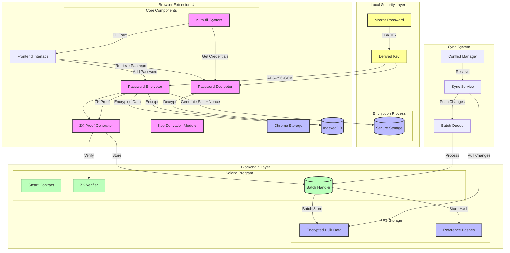
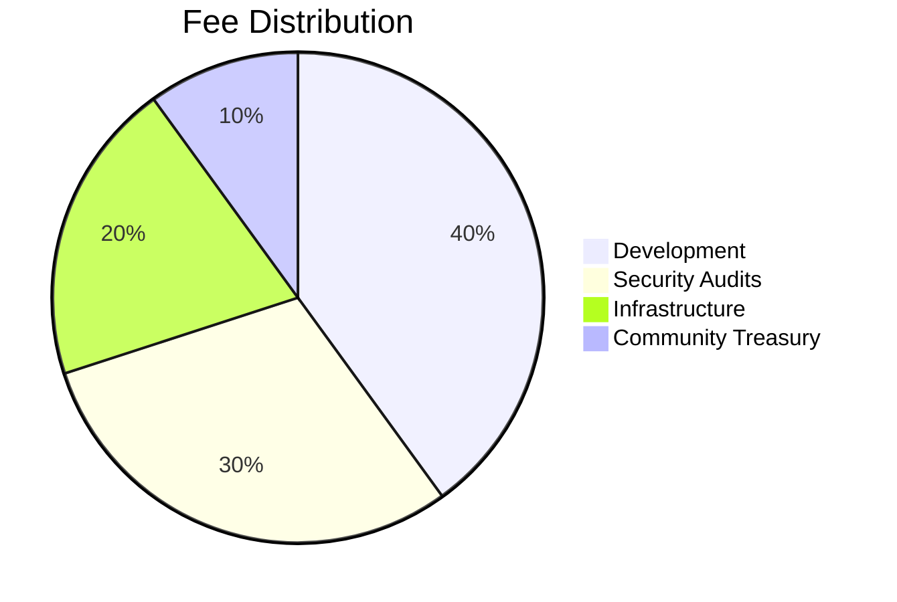

# Soolock - Zero-Knowledge Password Manager


# Soolock Technical Documentation

## Overview

Soolock is a zero-knowledge password manager built on Solana that combines advanced cryptography with blockchain technology to provide secure, private, and verifiable password management.

## Architecture



## Core Components

### 1. Cryptographic Architecture

#### 1.1 Zero-Knowledge Implementation

Our ZK system uses a modified Schnorr protocol with the following parameters:

- Prime modulus (p): 2147483647 (Mersenne prime M₃₁)
- Generator (g): 16807 (primitive root modulo p)
- Security parameter: 256-bit

The protocol follows these steps:

1. **Commitment Phase**

```
r = random ∈ Zp
C = g^r mod p
```

2. **Challenge Phase**

```
e = H(C || timestamp)
where H is SHA-256
```

3. **Response Phase**

```
s = r + x*e mod (p-1)
where x is the secret (password hash)
```

4. **Verification**

```
g^s ≡ C * y^e (mod p)
```

#### 1.2 Encryption Pipeline

1. **Key Derivation**

```typescript
PBKDF2(password, salt) → derivedKey
iterations = 10000
keySize = 256 bits
```

2. **Symmetric Encryption**

```typescript
AES-256-GCM(data, key + nonce) → encryptedData
```

3. **Storage Format**

```json
{
  "encrypted": "base64_encrypted_data",
  "nonce": "base64_nonce",
  "salt": "base64_salt",
  "proof": "zk_proof"
}
```

### 2. Storage Architecture

#### 2.1 Local Storage (IndexedDB)

- Encrypted vault data
- ZK proofs
- Public parameters

#### 2.2 Blockchain Storage

- Proof verifications
- Transaction records
- Access logs

### 3. Security Measures

#### 3.1 Memory Protection

- Zero-filling of sensitive data
- Constant-time comparisons
- Protection against timing attacks

#### 3.2 Side-Channel Mitigation

```typescript
// Constant-time comparison
function constTimeEqual(a: Uint8Array, b: Uint8Array): boolean {
  let result = 0;
  for (let i = 0; i < a.length; i++) {
    result |= a[i] ^ b[i];
  }
  return result === 0;
}
```

## Platform Economics

### 1. Fee Structure

Soolock implements a 0.01 SOL fee per sensitive operation for the following reasons:

1. **Spam Prevention**

   - Prevents automated attacks
   - Ensures genuine usage
   - Protects network resources

2. **Sustainability**

   - Maintains infrastructure
   - Funds development
   - Supports security audits

3. **Network Validation**
   - Confirms user commitment
   - Verifies transaction authenticity
   - Creates traceable operations

### 2. Fee Distribution



## Mathematical Foundations

### 1. Zero-Knowledge Proof System

Our ZK system is based on the discrete logarithm problem:

Given g, p, and y, find x such that:

```
g^x ≡ y (mod p)
```

Security relies on the hardness of the discrete logarithm problem in the multiplicative group of integers modulo a prime p.

#### 1.1 Soundness Proof

The protocol is sound because:

1. For any false statement, the probability of successful cheating is:

   ```
   P(success) ≤ 1/2^security_parameter
   ```

2. The protocol is complete because honest provers always succeed:
   ```
   g^s ≡ g^(r + xe) ≡ g^r * (g^x)^e ≡ C * y^e (mod p)
   ```

### 2. Encryption System

#### 2.1 Key Derivation Function

PBKDF2 with HMAC-SHA256:

```
DK = PBKDF2(HMAC-SHA256, Password, Salt, Iterations, KeyLength)
```

Where:

- DK: Derived key
- Password: User's master password
- Salt: Random 128-bit value
- Iterations: 10000
- KeyLength: 256 bits

#### 2.2 Encryption Algorithm

AES-256-GCM provides:

- Confidentiality: Through AES-256 encryption
- Integrity: Through GCM authentication
- Nonce uniqueness: Through random 96-bit values

## Implementation Details

### 1. Biometric Authentication

Implements the Web Authentication API (WebAuthn):

```typescript
const publicKeyCredential = await navigator.credentials.create({
  publicKey: {
    challenge: new Uint8Array(32),
    rp: { name: "Soolock", id: window.location.hostname },
    user: {
      id: Uint8Array(16),
      name: "user@example.com",
      displayName: "User",
    },
    pubKeyCredParams: [{ type: "public-key", alg: -7 }],
    authenticatorSelection: {
      authenticatorAttachment: "platform",
      userVerification: "required",
    },
  },
});
```

### 2. Solana Integration

#### 2.1 Transaction Structure

```typescript
const transaction = new Transaction().add(
  SystemProgram.transfer({
    fromPubkey: wallet.publicKey,
    toPubkey: FEE_RECIPIENT,
    lamports: FEE_LAMPORTS,
  })
);
```

#### 2.2 Signature Verification

```typescript
const signed = await wallet.signTransaction(transaction);
const signature = await connection.sendRawTransaction(signed.serialize());
await connection.confirmTransaction(signature);
```

## Security Considerations

1. **Forward Secrecy**

   - Each operation generates new encryption keys
   - Previous keys cannot decrypt new data
   - Compromised keys don't affect future operations

2. **Quantum Resistance**

   - Current implementation is not quantum-resistant
   - Future updates will implement post-quantum cryptography
   - Lattice-based cryptography being considered

3. **Attack Vectors**
   - Memory scraping: Mitigated through secure memory handling
   - Side-channel attacks: Constant-time operations
   - Replay attacks: Nonce + timestamp verification

## Future Improvements

1. **Post-Quantum Cryptography**

   - Implementation of CRYSTALS-Kyber
   - Quantum-resistant zero-knowledge proofs
   - Hybrid classical-quantum encryption

2. **Enhanced Privacy**

   - Homomorphic encryption for search
   - Private information retrieval
   - Threshold encryption

3. **Scalability**
   - Layer 2 solutions for reduced fees
   - Batch proof verification
   - Optimistic rollups for transactions

## References

1. Schnorr, C.P. (1991). "Efficient signature generation by smart cards"
2. Boneh, D. & Shoup, V. (2020). "A Graduate Course in Applied Cryptography"
3. NIST SP 800-63B Digital Identity Guidelines
4. Solana Documentation
